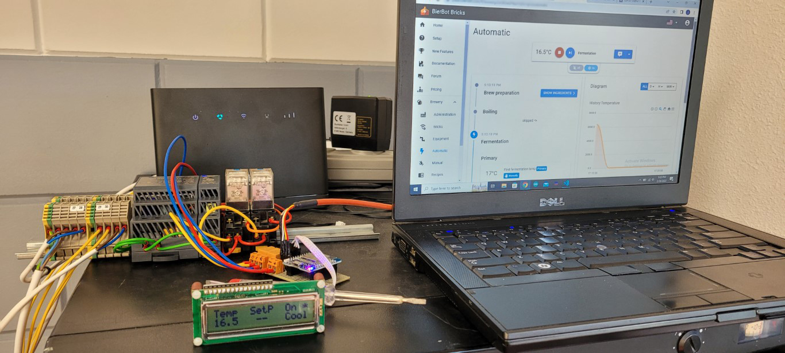

# BookusBrick
[BierBot](https://bierbot.com/) compatible brewing and fermentation controller based upon an ESP32 board.

This project is still in an early stage and I'm still developing code.
I decided to code an additional BierBot compatible brick as I had some additional requirements next to the existing ones (see : [GitHub Bernhard Schlegel](https://github.com/BernhardSchlegel/) .. excellent work by the way). 

### The Name
One of my hobbies (guess what?) is brewing beer. I do this together with my son. Our hobby-brewery is called "Bookes Beer". Hence the name of the brick :-).

### Supports
I planned to use the BierBot system (as a starter) for an fermentation temperature chamber. So I made this list...
* Multiple actuators (at least 2)
* 1 DS18B20 temperature sensor
* Display support : for now a simple I2C 16x2 LCD display I had laying around, showing
  * Current temperature
  * Heating/Cooling status
  * Operational errors
  * On/offline status
  * Compressor delay
* Temperature Set-point
  * using BierBot LCD-API (maybe)
* Configurable using a single C include file

### Future extentions, ideas and thoughts
* Fallback temperature control in case of being offline
* Support for NTC based temperature sensors
* Add beeper
* Would like to see PWM support for heating elements (using SSR)...(note: my boiling kettle has two heating elements...so I would control both with 1 PWM value)
* Add support for other display types

### Pictures

Some pictures of my prototype. Screen is showing (from left to right):
* Current temperature
* Placeholder for set-point temperature
* On(line)/Off(line) status + blinking * (= heartbeat)
* Cool (+compressor delay) / Heat

